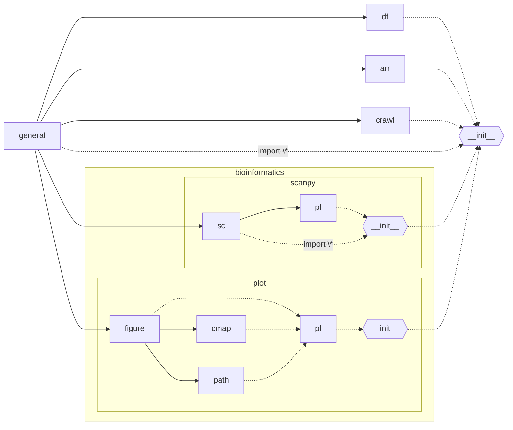

# utils_py

python工具函数库

<script src="https://unpkg.com/mermaid/dist/mermaid.min.js"></script>



建议使用时额外写一个`init.py`, 将使用的函数均导入

再将`init.py`引入

`init`中存放多种初始化文件

```
import sys
from pathlib import Path

p_temp = str(Path("~/link").expanduser())
None if p_temp in sys.path else sys.path.append(p_temp)

import utils_py as ut
from utils_py.general import *

# 绘图 ut.pl
ut.init_pl()
pl = ut.pl

# scRNA ut.sc
ut.init_sc()

```

