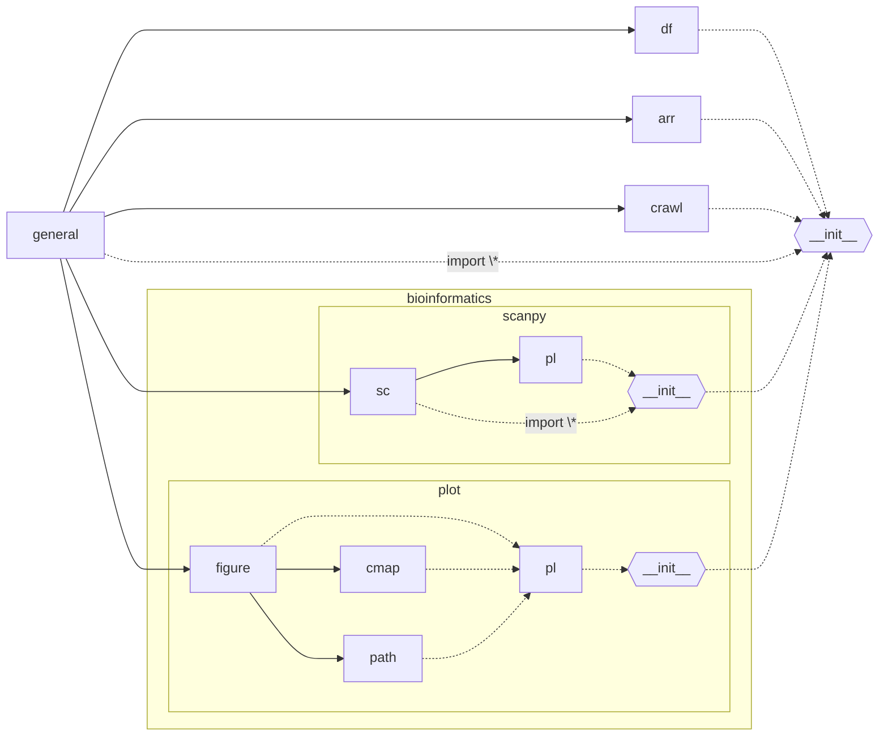

# utils_py

python工具函数库

建议使用时额外写一个`init.py`, 将使用的函数均导入

再将`init.py`引入

```mermaid
graph LR;
    __init__{{__init__}};
    general[general];
    general --> df[df];
    general --> arr[arr];
    df -.-> __init__
    arr -.-> __init__
    general --> crawl[crawl]
    crawl -.-> __init__
    general -."import \*".->  __init__
    subgraph bioinformatics
        subgraph scanpy
            scanpy.__init__{{__init__}};
            scanpy.sc[sc];
            scanpy.pl[pl];
            scanpy.sc -->scanpy.pl
            scanpy.pl -.-> scanpy.__init__
            scanpy.sc -."import \*".-> scanpy.__init__
        end

        subgraph plot
            plot.__init__{{__init__}};
            plot.figure[figure];
            plot.pl[pl];

            plot.figure -.-> plot.pl
            plot.pl -.-> plot.__init__

            plot.cmap[cmap];
            plot.cmap -.-> plot.pl
            plot.figure --> plot.cmap

            plot.path[path];
            plot.figure --> plot.path -.-> plot.pl
        end
    end
    general --> scanpy.sc
    scanpy.__init__ -.-> __init__

    general --> plot.figure
    plot.__init__ -.-> __init__

```