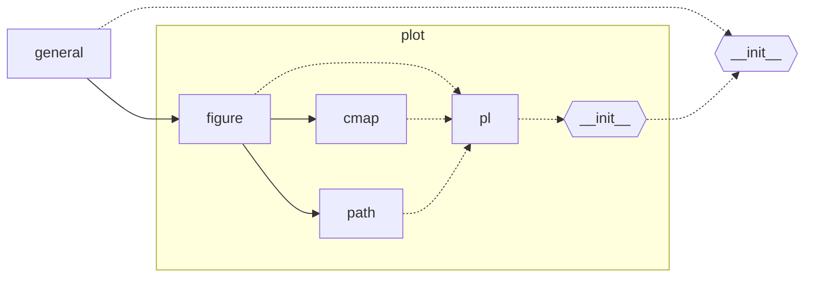

```mermaid
graph LR;
    __init__{{__init__}};
    general[general];
    general[general] -.-> __init__;


    subgraph plot
        plot.__init__{{__init__}};
        plot.figure[figure];
        plot.pl[pl];

        plot.figure -.-> plot.pl
        plot.pl -.-> plot.__init__

        plot.cmap[cmap];
        plot.cmap -.-> plot.pl
        plot.figure --> plot.cmap

        plot.path[path];
        plot.figure --> plot.path -.-> plot.pl
    end

    general --> plot.figure
    plot.__init__ -.-> __init__

```
