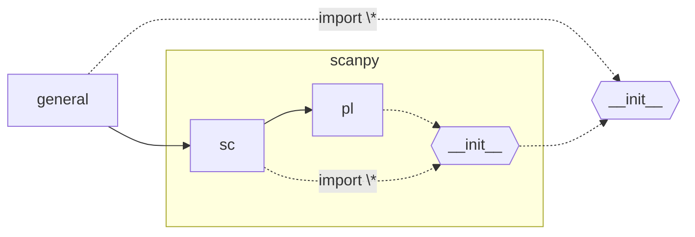

```mermaid
graph LR;
    __init__{{__init__}};
    general[general];
    general[general] -."import \*".-> __init__;

    subgraph scanpy
        scanpy.__init__{{__init__}};
        scanpy.sc[sc];
        scanpy.pl[pl];
        scanpy.sc -->scanpy.pl
        scanpy.pl -.-> scanpy.__init__
        scanpy.sc -."import \*".->  scanpy.__init__
    end
    general --> scanpy.sc
    scanpy.__init__ -.-> __init__

```